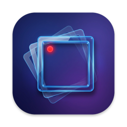

  

<h1 align="center">Jeefi</h1>

  A see-through frame for your Mac. Put it over anything, press Record, get a small GIF.

  <a href="https://github.com/mehrad-meraji/jeefi-releases/releases/latest"><b>Download for Mac</b></a>
  · macOS 15 or later · Apple Silicon and Intel

  

## Features

- **See-through frame.** Drag its edges or corners to resize, drag the bar to move. Clicks go through to the apps underneath.
- **Record in one click.** 3-second countdown, 10 / 15 / 30 fps, up to 60 seconds.
- **Small GIFs.** Only the parts that change are saved, and still moments become one frame. Turn on 1× size for GIFs about 17× smaller than a plain recording.
- **Never lose a take.** If a save fails or you cancel, Jeefi asks before throwing the recording away.
- **Updates itself.** New versions install with one click.

## Install

1. Download `Jeefi-<version>.dmg` from the [latest release](https://github.com/mehrad-meraji/jeefi-releases/releases/latest).
2. Open it and drag **Jeefi** into **Applications**.
3. Open Jeefi. macOS asks for **Screen Recording** permission: turn Jeefi on in System Settings › Privacy & Security › Screen & System Audio Recording, then open Jeefi again.

## How to use

1. Move the frame over what you want to record.
2. Pick a frame rate and press **Record**.
3. Press **Stop** and save the GIF.

**Show or hide the frame:** Window › Show / Hide Frame (⌘F), or click Jeefi in the Dock.

## GIF settings

Jeefi › Settings… (⌘,)

| Setting | What it does |
|---|---|
| Only save what changed | Each frame stores just the part of the picture that changed. |
| Merge repeated frames | When nothing changes, one frame is shown longer. |
| Size | **Sharp (Retina)** for crisp text, **Small (1×)** for the smallest file. |

## Updates

Jeefi checks for updates about once a day. Jeefi › Check for Updates… checks now.

## License

Copyright © 2026 Mehrad Meraji. All rights reserved. See [LICENSE](LICENSE).
